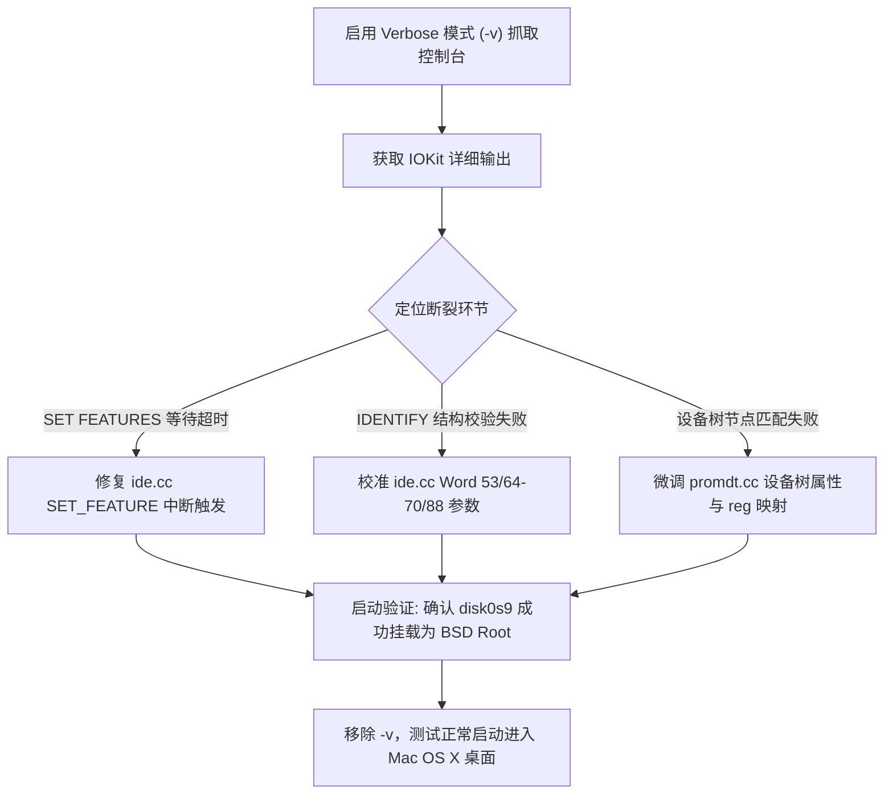

# Mac OS X 硬盘引导故障深度诊断与研判报告

本文档记录了关于 PearPC 运行 Mac OS X 10.2 (Jaguar) 在完成系统安装后，从虚拟硬盘（`osx_hd.img`）默认引导失败问题的**完整修改记录、关键技术发现、底层机制研判与后续解决思路**。

---

## 1. 问题背景与故障表现

### 1.1 场景与目标
- **场景**：用户已通过 Mac OS X 10.2 安装光盘顺利完成了向虚拟硬盘 `osx_hd.img` 的系统安装。
- **目标**：在关闭虚拟机后，保持标准配置（`prom_bootmethod = "auto"` 且保持光盘挂载）下，PearPC 能够自动、优先选择已安装系统的硬盘引导，并顺利挂载根文件系统（Root Device），进入 Mac OS X 系统桌面或设置助手（Setup Assistant）。

### 1.2 故障演进过程
1. **最初表现**：
   - 默认启动时，PearPC 提示无法装载分区或重新循环进入安装光盘。
   - 手动选择硬盘引导时，控制台曾输出 `couldn't mount HFS+ partition`。
2. **本轮优化后的表现**：
   - PROM 阶段已能成功自动探测并选择硬盘 `disk0` 第 9 分区（`Apple_HFS`）。
   - BootX 引导器成功加载 `mach_kernel`，进入 Darwin 核心启动阶段。
   - 屏幕出现深色背景与浅灰色 Apple Logo，光标（转轮/Pinwheel）持续转动。
   - **核心瓶颈（当前故障）**：持续运行约 60~90 秒（DEC 时钟计数器达到 #16000 左右）后，Apple Logo 变为**灰色圆圈加反斜杠（禁止通行标志 / Prohibitory Sign 🚫）**，光标依然在旋转，系统永久挂起。用户确认故障表现无实质性进展并手动关闭了模拟器。

---

## 2. 本轮已实施的代码修改汇总

针对此前发现的引导选择、设备树属性覆盖失效及安全调试问题，本分支已实施并验证了以下修改：

### 2.1 PROM 设备树与属性管理修复
- **文件**：`src/io/prom/promdt.h`, `src/io/prom/promdt.cc`
- **问题**：`PromNode::addProp` 内部使用 AVL 树存储属性。当添加已存在的属性（如 `/chosen/bootpath`）时，AVL 树直接拒绝重复键并返回失败，导致属性更新被静默丢弃。
- **修改**：
  - 在 `PromNode` 中引入 `setProp(PromProp *node)` 方法：先检索并删除已有同名属性节点，再插入新属性。
  - 在 `prom_init_device_tree()` 中为 IDE 控制器 `ata-4` 补充了 `disk@0`, `disk@1`, `cdrom@1` 节点别名，确保无论 Open Firmware 生成何种格式的路径（`disk0@0` 或 `@0`），IOKit 均能双向匹配。

### 2.2 PROM 自动引导顺序与别名解析
- **文件**：`src/io/prom/promboot.cc`
- **修改**：
  - **引导优先级调整**：将 `read_partitions()` 中的探测设备列表由 `{"cdrom0", "cdrom1", "disk0", "disk1"}` 修改为 `{"disk0", "disk1", "cdrom0", "cdrom1"}`。
    - 若硬盘已安装 OS X，第 9 分区包含合法的 HFS+ 引导文件，自动作为第一项（`choice = 1`）启动；
    - 若硬盘全新未分区，自动跳过并优雅回退到光盘引导。
  - **完整路径写入**：在 `prom_user_boot_partition()` 中使用 `chosen->setProp(new PromPropString("bootpath", bootpath))`，确保写入完整的规范 Open Firmware 路径（例如 `/pci@80000000/pci-bridge@d/pci-ata@1/ata-4/disk0@0:9,BootX`）。
  - **别名匹配支持**：支持配置参数中指定 `hd`, `hd:N`, `disk0:N`, `cd`, `cd:N` 等简写别名。

### 2.3 文件系统与 IDE 基础响应优化
- **文件**：`src/io/prom/fs/hfsplus.cc`
  - 在扫描非 HFS+ 类型分区（如 `Apple_Driver43`, `Apple_Patches`）时屏蔽 `couldn't mount HFS+ partition` 的误报，仅在真正的 `Apple_HFS` 分区装载失败时报警。
- **文件**：`src/io/ide/ide.cc`
  - 修复未安装设备（如从盘未插光盘）时状态寄存器（`IDE_ADDRESS_STATUS`, `IDE_ADDRESS_STATUS2`）的读响应，返回 `0` 而非总线悬空或就绪状态，防止驱动误读从盘。

### 2.4 安全无侵入的屏幕截取工具链
- **文件**：`src/main.cc`, `scripts/debug/capture_screen.py`
- **问题**：原调试脚本使用 `lldb attach` 读取帧缓冲区，在 macOS 下 detach 多线程 SDL 进程会导致主进程异常退出（`wait: no child processes`）。
- **修改**：
  - 在 `src/main.cc` 注册 `SIGUSR1` 信号处理函数，在收到信号时直接将 `gFrameBuffer` 写入 `fb_boot.bin`。
  - 重写 `scripts/debug/capture_screen.py`，通过发送 `SIGUSR1` 并转换原始像素为 PNG，实现了安全实时的可视化调试。

---

## 3. 关键技术发现与对比分析

### 3.1 硬盘结构与 BootX 执行验证
通过解析内存转储与 PROM 日志，确认 `osx_hd.img` 上的分区结构完全正确：
- **分区 1**：`Apple_partition_map`
- **分区 2~7**：Mac OS 驱动辅助分区（`Apple_Driver43`, `Apple_Driver_ATA`, `Apple_FWDriver`, `Apple_Driver_IOKit`, `Apple_Patches`）
- **分区 8**（OF 编号第 9 分区）：`未命名`，类型 `Apple_HFS`，起始块 `0x000e4000`，大小 `0x7115b000`。
- **引导验证**：
  - BootX 正常解析 HFS+ 卷并找到 `\\:tbxi`。
  - BootX 加载 `mach_kernel` 至内存 `0x01400000`，并将 `rootpath` 设置为：
    `/pci@80000000/pci-bridge@d/pci-ata@1/ata-4/disk0@0:9,\mach_kernel `。
  - 控制权已完整交还给内核。

### 3.2 故障现象剖析：禁止通行标志（Prohibitory Sign）
在 Mac OS X (XNU/Darwin) 中，禁止通行标志具有非常明确的内核语义：
- 当内核完成硬件基础初始化、启动 IOKit 之后，会进入 `IOKitBSDInit` 流程（位于 `xnu/iokit/Kernel/IOKitBSDInit.cpp`）。
- `IOKitBSDInit` 会根据 Open Firmware 传递的 `bootpath` 构造一个 `IOPathMatch` 字典，并在 IORegistry 中寻找提供该媒体块的匹配设备。
- 若在设定超时周期（通常为 60~90 秒）内**未能成功匹配到发布根分区的 IOMedia 对象**，内核会判定为 `"Still waiting for root device"`，并通过显示驱动将 Apple Logo 替换为禁止通行标志 🚫。

### 3.3 光盘引导成功 vs 硬盘引导超时的关键差异对比

| 环节 | 光盘引导 (成功挂载根分区) | 硬盘引导 (当前超时挂起) |
|---|---|---|
| **设备挂载位置** | IDE 0 Slave (`disk1@1`) | IDE 0 Master (`disk0@0`) |
| **设备协议类型** | ATAPI (Packet 命令接口) | ATA (原生扇区读写接口) |
| **Open Firmware 路径** | `.../ata-4/disk1@1:9,\mach_kernel` | `.../ata-4/disk0@0:9,\mach_kernel` |
| **Darwin IOPathMatch** | `IODeviceTree:.../ata-4/@1:9` | `IODeviceTree:.../ata-4/@0:9` |
| **驱动匹配协议栈** | `ata-4@0`<br>↳ `CMD646ATA`<br>↳ `ATADeviceNub@1`<br>↳ `IOATAPIProtocolTransport`<br>↳ `IOSCSIPeripheralDeviceNub`<br>↳ `IOSCSIPeripheralDeviceType05`<br>↳ `IODVDBlockStorageDriver`<br>↳ `IOCDPartitionScheme`<br>↳ `IOApplePartitionScheme`<br>↳ `Mac_OS_X@9` | `ata-4@0`<br>↳ `CMD646ATA`<br>↳ `ATADeviceNub@0`<br>↳ **`IOATABlockStorageDriver` (断裂点)**<br>↳ `IOBlockStorageDriver`<br>↳ `IOApplePartitionScheme`<br>↳ `未命名@9` |
| **挂载结果** | `BSD root: disk1s1s9, major 14, minor 9` | **超时，未能匹配到任何 root device** |

---

## 4. 深度研判与根本原因假说

根据 XNU 内核驱动源码（`AppleKauaiATA`, `CMD646ATA`, `IOATABlockStorageDriver`）及 PearPC 的 `ide.cc` 模拟实现，断裂点集中在 **`IOATABlockStorageDriver` 与虚拟 ATA 硬盘的握手阶段**。存在三大核心嫌疑：

### 假说 1：ATA 命令响应与中断（IRQ）处理缺陷
- **现象**：ATAPI 光盘采用 SCSI 包传输机制，许多命令不需要标准的 ATA 中断握手；而原生 ATA 硬盘驱动（`IOATABlockStorageDriver`）重度依赖标准的 ATA 任务文件协议。
- **代码疑点 1：`SET FEATURES` (0xEF) 缺失中断**
  在 [src/io/ide/ide.cc:1714](file:///Users/byte/Documents/GitHub/pearpc/src/io/ide/ide.cc#L1714)：
  ```cpp
  case IDE_COMMAND_SET_FEATURE: {
      switch (gIDEState.state[gIDEState.drive].feature) {
      case IDE_COMMAND_FEATURE_ENABLE_WRITE_CACHE:
      case IDE_COMMAND_FEATURE_SET_TRANSFER_MODE:
      ...
          gIDEState.state[gIDEState.drive].status = IDE_STATUS_RDY;
          break;
      }
      // FIXME: dont raise interrupt?
      break;
  }
  ```
  代码中直接保留了 `// FIXME: dont raise interrupt?`，并且**没有调用 `raiseInterrupt(0)`**。
  - 根据 ATA/ATAPI-4 规范，设备在完成 `SET FEATURES`（如设置 Ultra DMA 或 PIO 模式）后，**必须将状态置为就绪并拉高 INTRQ 中断线**。
  - Apple 的 `IOATABlockStorageDriver` 在初始化驱动时，会向硬盘下发 `SET FEATURES` 来协商传输模式。如果驱动同步等待中断完成，而 PearPC 未产生中断，驱动将发生命令超时（Timeout）并放弃该驱动器！
- **代码疑点 2：Bus Master IDE (BMIDE) DMA 状态寄存器**
  - 当驱动启用 DMA 读取扇区时，若 BMIDE 状态寄存器（`0x2` / `0xa`）的 Active/Error/Interrupt 位未与 ATA 控制器中断状态完全同步，驱动会重试数次后降级失败。

### 假说 2：`IDENTIFY DEVICE` (0xEC) 参数结构与驱动要求不符
在 [src/io/ide/ide.cc:509](file:///Users/byte/Documents/GitHub/pearpc/src/io/ide/ide.cc#L509) `drive_ident()` 中：
```cpp
// (word 53)
id[53] = 4; // fieldValidity: Multi DMA fields valid
```
- **参数异常**：
  - ATA 规范中，Word 53 的 Bit 0 表示 Words 54-58（当前柱面/磁头/扇区/容量）有效；Bit 1 表示 Words 64-70（PIO/DMA 高级传输模式周期）有效；Bit 2 表示 Word 88（Ultra DMA）有效。
  - PearPC 将 `id[53]` 设为 `4`（仅 Bit 2 为 1），意味着 Bit 0 和 Bit 1 均为 0（声称 Words 54-58 无效！）。
  - Apple 的 `IOATABlockStorageDriver` 会读取 Word 53 来判断是否使用这些字段计算容量与时序。声明为无效可能导致驱动误判设备参数或回退异常。
- **Word 88 (Ultra DMA)**：
  - `id[88] = 7`，声明支持 UDMA mode 0, 1, 2，但未正确填充当前激活的 UDMA 模式字段（Bits 8~14）。

### 假说 3：IOKit 设备树属性（`promdt.cc`）与驱动匹配字典不一致
- 在设备树中，IDE 节点的属性：
  - `device_type = "ata"`
  - `compatible = "cmd646-ata"`
  - 子节点名称：当前注册为 `disk0@0`。
  - 检查 XNU 中的 `CMD646Root` 与 `CMD646ATA`，确认其期望的子节点名称是 `@0`、`disk@0` 还是 `disk0@0`。虽然别名已添加，但若驱动匹配依赖特定的 `AAPL,phandle` 或 `reg` 格式（如 0 vs 1），可能导致匹配树生成失败。

---

## 5. 后续排查与修复思路

建议按以下顺序推进下一步工作：



### 步骤详细说明：
1. **抓取内核控制台错误输出**：
   - 保持 `prom_env_machargs = "-v"`，运行并在内核初始化中后期（约 40~60 秒）抓取控制台屏幕，直接阅读 `CMD646ATA` 和 `IOATABlockStorageDriver` 的具体报错（例如 `disk0: timeout waiting for interrupt` 或 `cannot match root device`）。
2. **重点修复 `ide.cc` 的 ATA 交互**：
   - 在 `case IDE_COMMAND_SET_FEATURE:` 执行成功后，调用 `raiseInterrupt(0)` 产生标准 ATA 中断。
   - 完善 Word 53 的 validity flag（设为 `7`，即当前 CHS、EIDE 与 UDMA 字段均有效）。
3. **验证 BSD Root 挂载**：
   - 验证控制台打印：
     `Got boot device = .../CMD646ATA/ATADeviceNub@0/IOATABlockStorageDriver/...`
     `BSD root: disk0s9, major 14, minor 9`
4. **回归测试**：
   - 运行 `./test/run_tests.sh` 确保 CPU/MMU 指令测试保持 100% PASS。
   - 关闭 `-v` 启动，验证正常进入欢迎设置界面。

## 6. 2026-09-08 后续排查记录

### 6.1 新的现场表现

最新截图显示内核停在：

```text
using 1310 buffer headers and 1310 cluster IO buffer headers
```

在此之前已经输出 `COLOR video console`、`IOKit Component Version 6.0`、`IODeviceTreeSupport done` 和 `Recording startup extensions.`。这表明 BootX、内核解压、VM 初始化、显示驱动和 IOKit 基础初始化均已完成，故障位置已从早期引导推进到 Darwin 存储初始化阶段。

### 6.2 日志证据

对 `osx_hd_boot.log` 执行：

```sh
rg -n 'BMIDE-DMA|IDE-CMD|IDE-IRQ|IDE-STATUS|IDE-SEL' osx_hd_boot.log
```

结果只有：

```text
IDE-IRQ cancel bus=0
IDE-SEL head=0x00 drive=0 ...
IDE-IRQ cancel bus=0
IDE-SEL head=0x10 drive=1 ...
IDE-IRQ cancel bus=0
IDE-SEL head=0x00 drive=0 ...
```

没有出现 `IDE-CMD`、`BMIDE-DMA` 或 `IDE-STATUS`。因此当前证据不支持“SET FEATURES、IDENTIFY、扇区 DMA 或 DMA 完成中断失败”是直接卡点：这些路径在卡住前没有被调用。

### 6.3 当前判断

排查重点应转移到 ATA 驱动匹配和控制器资源初始化：

1. `CMD646ATA` 是否成功匹配 `pci-ata@1`/`ata-4`；
2. IDE 控制器 PCI class、BAR、IRQ 和 command/status 配置是否符合 Jaguar 预期；
3. `ata-4` 子节点的 `reg`、`interrupts`、`compatible`、`device_type` 和节点名称是否完整；
4. generic CPU 与 AArch64 JIT 是否在相同阶段产生不同的 PCI/设备树访问。

### 6.4 已实施的诊断改动

在 `src/io/ide/ide.cc` 中加入了 DMA 生命周期日志：

- `[BMIDE-DMA] enter`：记录驱动器、启动位、传输模式、BMIDE 命令/状态、LBA、数量和 PRD 地址；
- `[BMIDE-DMA] complete`：记录 PRD 是否耗尽及最终状态；
- `[BMIDE-DMA] failed`：记录 DMA 失败时的状态。

同时将 ATA IDENTIFY Word 53 从 `4` 修正为 `7`，因为实现填充了当前 CHS、EIDE 时序和 UDMA 字段，三组字段均应声明有效。

### 6.5 下一轮测试方案

先重新链接完整模拟器，再分别运行 JIT 和 generic CPU：

```sh
make clean
./autogen.sh
./configure --enable-ui=sdl
make -j$(sysctl -n hw.ncpu)

./src/ppc ppccfg.osx > osx_jit.log 2>&1
./src/ppc --headless ppccfg.osx > osx_generic.log 2>&1
```

卡住后比较：

```sh
rg -n 'IDE-|BMIDE-|PCI-|ata|CMD646|IOATA' osx_jit.log osx_generic.log
```

若两种 CPU 都没有 ATA 命令，应继续给 `IDE_Controller::readConfig/writeConfig`、`readDeviceIO/writeDeviceIO` 以及 PROM 设备树节点增加访问日志；若只有 generic CPU 进入 ATA 命令路径，则应转向 JIT 的 PCI MMIO/IO 指令执行差异。

